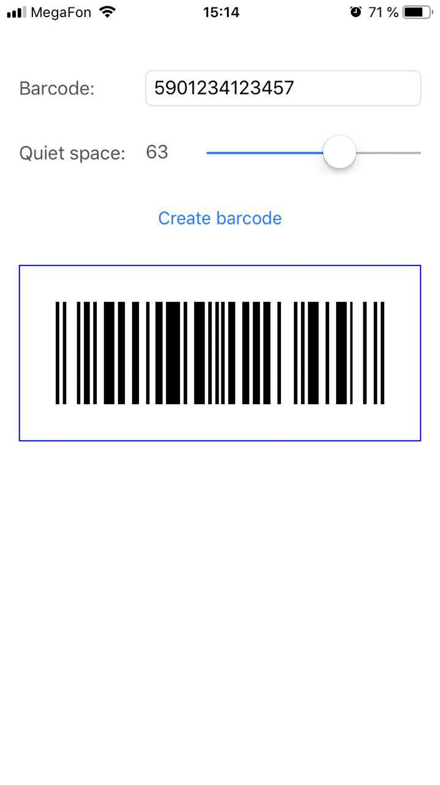

# EANBarcodeGenerator

[](https://travis-ci.org/ampirator/EANBarcodeGenerator)
[](https://cocoapods.org/pods/EANBarcodeGenerator)
[](https://cocoapods.org/pods/EANBarcodeGenerator)
[](https://cocoapods.org/pods/EANBarcodeGenerator)

EANBarcodeGenerator provides CIFilter `CIEANBarcodeGenerator` for generating EAN-13, UPC-A barcodes. This generator was created for iOS application PokeWall (https://itunes.apple.com/us/app/pokewall/id1449455385)

## Example

To run the example project, clone the repo, and run `pod install` from the Example directory first.


## Requirements

iOS 9.0+

## Installation

EANBarcodeGenerator is available through [CocoaPods](https://cocoapods.org). To install
it, simply add the following line to your Podfile:

```ruby
pod 'EANBarcodeGenerator'
```

## Usage

Import Framework:
```swift
import EANBarcodeGenerator
```

Register CIFilter: 
```swift
CIEANBarcodeGenerator.register()
``` 
you can place this code for example into method of ApplicationDelegate  `application(_ application: UIApplication, didFinishLaunchingWithOptions launchOptions: [UIApplicationLaunchOptionsKey: Any]?)` 

Generate barcode:
```swift
let filter = CIFilter(name: "CIEANBarcodeGenerator")
filter?.setValue("5901234123457", forKey: "inputMessage")
let image = filter?.outputImage
```
`outputImage` represents CIImage with width: 95 pixels, height: 32 pixels. To get UIImage with certain size, you can use next code:
```swift
let scaleX = uiImageSize.width / ciImage.extent.width
let scaleY = uiImageSize.height / ciImage.extent.height
let uiImage = UIImage(ciImage: ciImage.transformed(by: CGAffineTransform(scaleX: scaleX, y: scaleY)))
```

## Author

Sergey Bayborodov, ampirator@gmail.com

## License

EANBarcodeGenerator is available under the MIT license. See the LICENSE file for more info.
